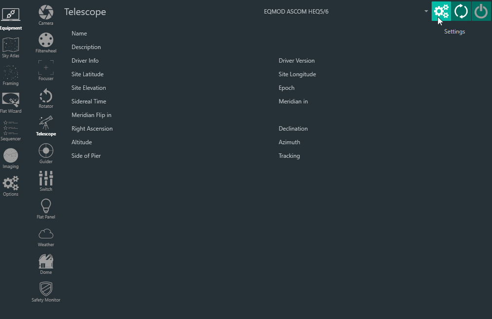
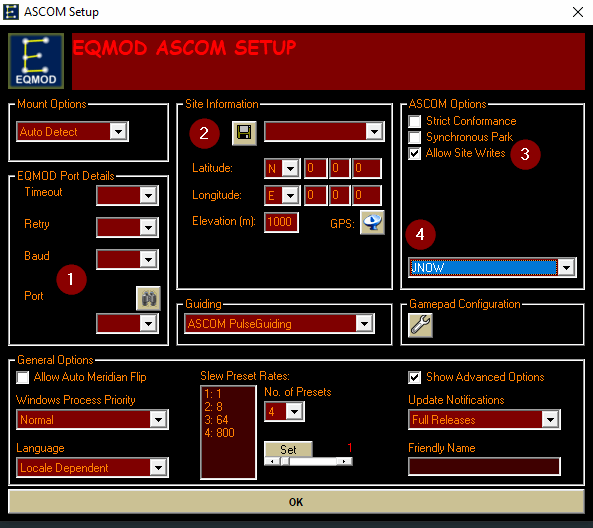
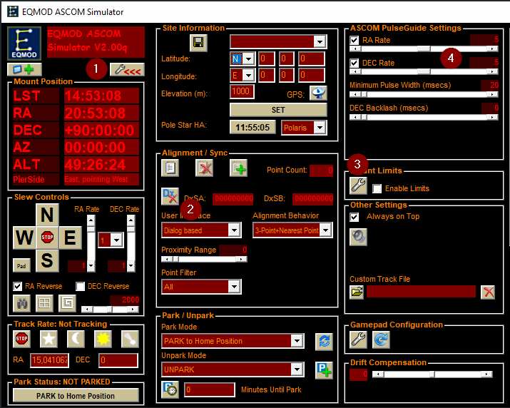

# EQMOD 设置

为了使 N.I.N.A. 与 EQMOD 良好配合，建议进行一些基本设置。

## 设置界面
要打开 EQMOD 的设置，请在设备页面中选择 EQMOD 条目并点击齿轮图标。

将打开一个新窗口，显示以下界面。

在此界面中填写上方截图中标记的信息

1. 根据 Windows 设备管理器，您的赤道仪连接的端口
2. 您的位置信息
3. 勾选允许站点写入，这将允许将您在 N.I.N.A. 中维护的位置同步到望远镜
4. 将历元设置从 Unknown 更改为 JNOW

## 连接界面

正确填写这些初始步骤后，即可继续连接赤道仪。
连接后 EQMOD 会打开一个单独的窗口显示当前望远镜状态。您需要在此进一步调整一些设置。

1. 展开望远镜面板以显示高级选项
2. 将"用户界面"设置为基于对话框，这是在 N.I.N.A. 中使用解析正确同步坐标到赤道仪时所必需的
3. 调整您的限位以匹配您的设备。限位应设置为不在 N.I.N.A. 发出中天翻转之前触发（这取决于您在 N.I.N.A. 中的翻转设置），而应该是出现问题时作为安全后备措施
4. 如果您使用 PHD2 等导星软件，建议将脉冲导星速率设置为至少 0.5，但更可能 0.9 对 RA 和 DEC 都是最佳选择