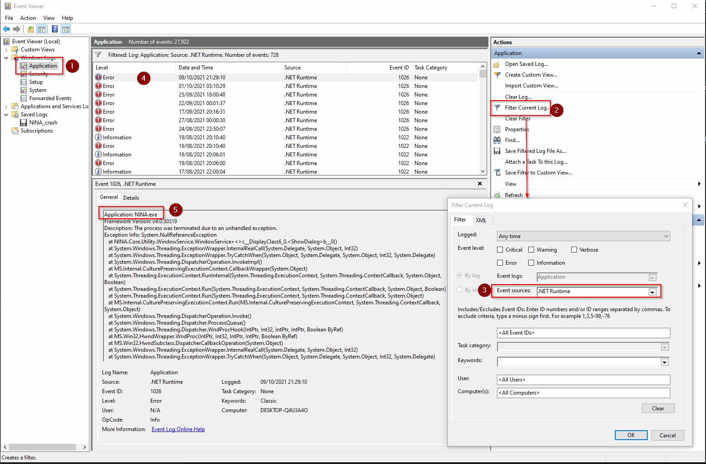

## 通用故障排查

如果您在使用 N.I.N.A. 期间遇到任何 bug，请在项目的[问题追踪器](https://github.com/isbeorn/nina/issues)上报告，或直接在 [Discord 聊天](//discord.gg/fwpmHU4)中联系团队。如有可能，请附上最新的日志文件。同时将应用程序的日志详细程度提高到**调试**或**跟踪**级别（位于**选项 > 日志级别**）也有助于排查。**跟踪**日志级别包含最多的信息，但可能导致大量日志文件积累。因此，不建议在正常情况下保持该级别。

日志文件位于 `%LOCALAPPDATA%\NINA\Logs\` 文件夹中。

## 安装问题

### 安装普遍失败

防病毒软件常常会干扰 N.I.N.A. 的安装，导致安装中止或不完整。
在此类情况下，建议暂时禁用所有防病毒软件，然后重试安装。
遇到安装问题的可能性因使用防病毒软件的数量和类型，以及防病毒软件的严格程度而异。
在 Windows 10 上仅使用微软内置的 Windows Defender 套件时，未发现重大问题。

### 错误："您尝试使用的功能位于不可用的网络资源上"

如果您遇到此错误或无法卸载应用程序，某些注册表项已损坏。请按照以下页面的建议修复损坏的注册表项：
[https://support.microsoft.com/en-us/topic/fix-problems-that-block-programs-from-being-installed-or-removed-cca7d1b6-65a9-3d98-426b-e9f927e1eb4d](https://support.microsoft.com/en-us/topic/fix-problems-that-block-programs-from-being-installed-or-removed-cca7d1b6-65a9-3d98-426b-e9f927e1eb4d)

## 应用程序崩溃

### 崩溃转储
如果您遇到硬崩溃，Windows 将创建崩溃转储文件以详细调查问题。如果您遇到此类问题，请提供此崩溃转储文件。

崩溃转储位于 `%LOCALAPPDATA%\NINA\CrashDump\` 文件夹中。

### 事件查看器

您可以检查 Windows 事件查看器以查找应用程序硬崩溃的根本原因。
要打开事件查看器，请转到 Windows 搜索栏，输入"事件查看器"并打开该应用程序。

进入应用程序后，转到"Windows 日志 -> 应用程序"（1）。然后进入"筛选当前日志..."（2），缩小"事件来源"范围（3），在弹出的窗口中只选中".NET Runtime"，点击"确定"。
应用筛选后，您可以在中间列表中找到所有事件来源（4）。在详细信息部分（5）中查找包含"Application: NINA.exe"的消息。这将显示应用程序崩溃的完整堆栈跟踪。这是有用的信息，可以发布给贡献者进行进一步分析。
