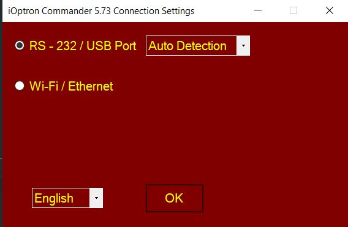
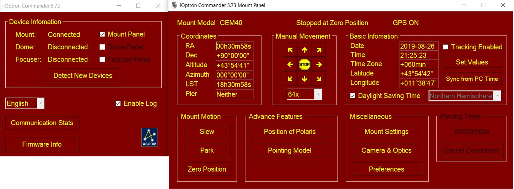
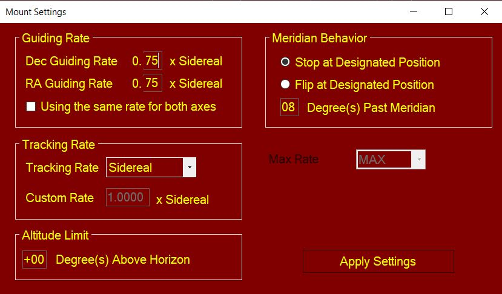
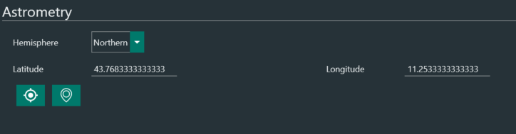
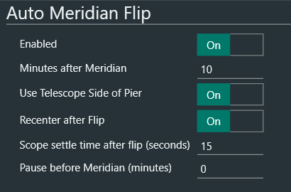

# iOptron 赤道仪设置

本说明旨在作为 iOptron 赤道仪搭配 N.I.N.A. 进行深空天体拍摄的快速参考。

本指南基于 iOptron ASCOM Commander v 3.73。

## 设置您的 iOptron 赤道仪

要连接赤道仪，首先确保赤道仪已通电并正确连接到您的电脑（请参阅 iOptron 说明书），然后打开 iOptron Commander 应用程序并点击连接赤道仪。

赤道仪连接后，打开赤道仪面板。

在偏好设置标签页中，您需要定义几个参数（请注意，所有这些参数也可以通过手控器配置）：

- 跟踪速率：对于深空拍摄设置为恒星速
- 导星速率：这是用于导星脉冲的速度（例如来自 PHD2）。典型值为 0.50x 到 0.75x 恒星速。为您的设备试验找到最佳值。通常您希望 RA 和 DEC 具有相同的导星速度（提示：如果更改此参数，记得重新校准 PHD2）
- 中天行为：这定义了赤道仪通过中天时的行为。由于您希望 N.I.N.A. 管理中天翻转，不要选择"在指定位置翻转"。替代选项"在指定位置停止"会在中天经过后根据"经过中天度数"中设置的值停止赤道仪跟踪。这是一项安全措施，防止赤道仪/镜筒撞击三脚架/立柱。查阅您的 iOptron 赤道仪说明书，确认其可以跟踪过中天多少度。典型值为 10 到 15 度，相当于中天过后 40-60 分钟（记住以恒星速计算 1° = 4 分钟）。设置一个您觉得舒适的值，从 0° 到您赤道仪极限的最大值。
注意：记住此值，因为它可能影响您在 N.I.N.A. 中的中天翻转设置，见第 2 节。

点击"应用设置"并关闭。

## 配置 N.I.N.A.

a) 启动 N.I.N.A.，历元为 JNOW 将自动检测。根据您的位置设置半球、纬度和经度（连接赤道仪时，如果赤道仪具有集成 GPS，N.I.N.A. 会询问您是否要从赤道仪同步纬度和经度）

b) 在选项 > 拍摄 > 自动中天翻转中，您可以定义赤道仪经过中天时的行为。请参阅 N.I.N.A. 的[此处文档](../advanced/meridianflip.md)了解每个参数的详细说明。

- 将启用设为"开"，这将启用自动中天翻转
- 中天过后分钟数定义了中天经过后等待多少分钟，N.I.N.A. 才会启动翻转序列
- 将使用望远镜支架侧设为"开"
- 将翻转后重新居中设为"开"。这将在翻转后解析并精确重新居中望远镜到目标
- 翻转后望远镜稳定时间（秒）：设置 15 到 30 秒的值
- 中天前暂停（分钟）：如果设置任何大于 0 的 n 值，N.I.N.A. 将在中天经过前 n 分钟停止赤道仪跟踪。通常当您需要在中天翻转前在赤道仪处执行某些任务时启用此选项，例如需要调整线缆以防缠绕。如果您的赤道仪可以毫无问题地经过中天，则设为 0
:::note
当中天前暂停设为"0"时，赤道仪将继续跟踪过中天，直到达到中天过后分钟数。确保您在中天过后分钟数中设置的时间短于您在 iOptron Commander 中设置的时间，否则赤道仪将在 N.I.N.A. 能够执行翻转之前停止。
例如，如果您在 iOptron Commander 中设置 2 度（8 分钟），在 N.I.N.A. 的中天过后分钟数中设置 15 分钟，iOptron Commander 将在中天经过后 8 分钟停止赤道仪，N.I.N.A. 将无法执行翻转程序。
:::

c) 在设备 > 望远镜下选择 iOptron ASCOM Driver for Mount，点击连接符号，享受您的拍摄之旅！

