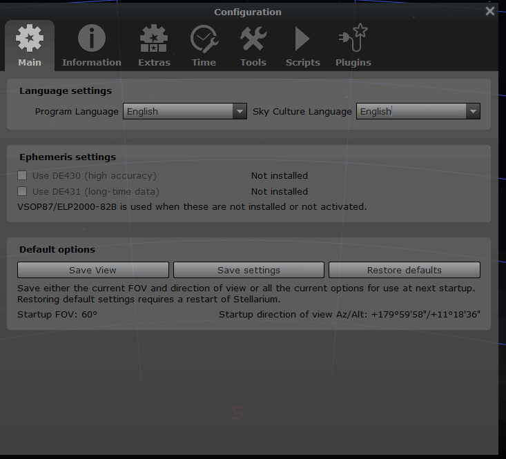
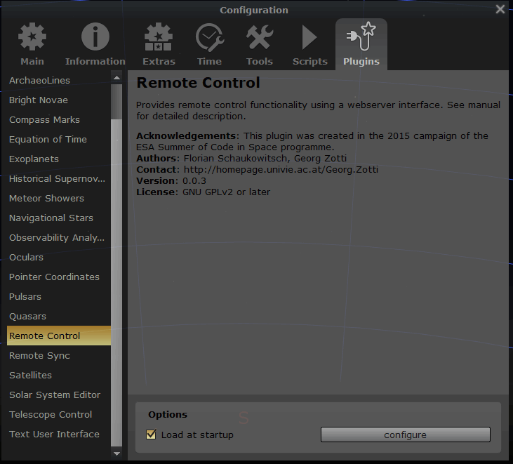
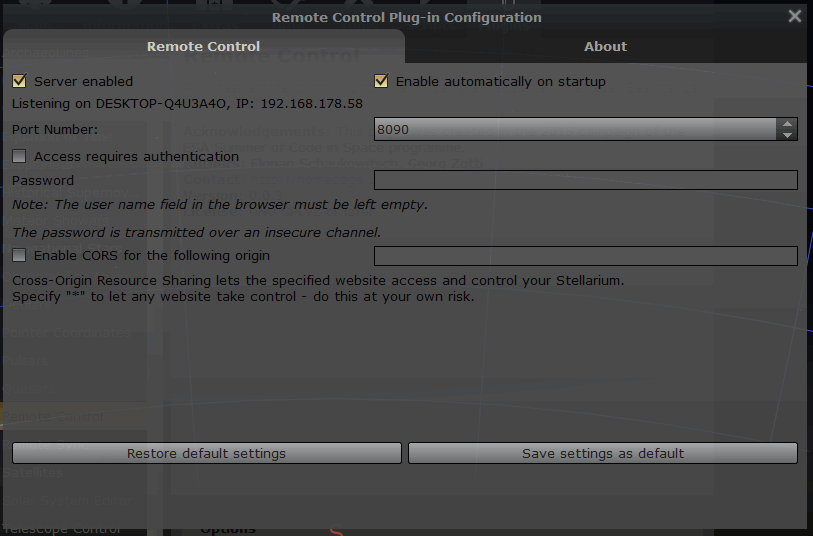

# Setting up planetarium software

## Stellarium

For Stellarium being able to sync coordinates to N.I.N.A. the remote plugin needs to be enabled and the server started.  
First head to the stellarium configuration by pressing F2 inside stellarium  

Head to the plugins tab, search for the "Remote Control" plugin and select it.  
On the right side, check the "Load at startup" option.  

Once the plugin is enabled, you also need to enable the plugin server. To do so, click on the "configuration" button and check "Server enabled" as well as "Enable automatically on startup" to not have to do this each time.  

