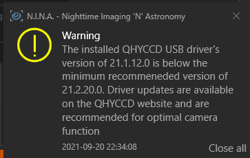
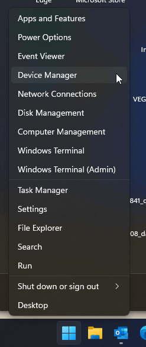
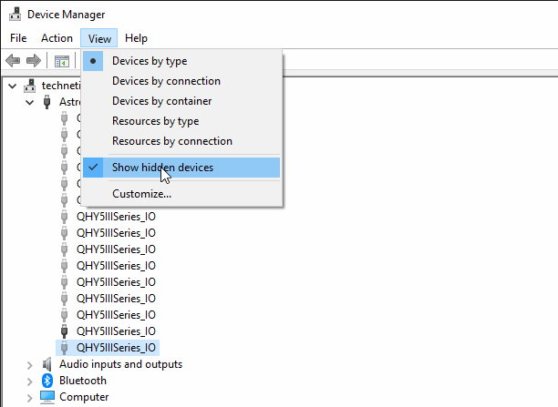
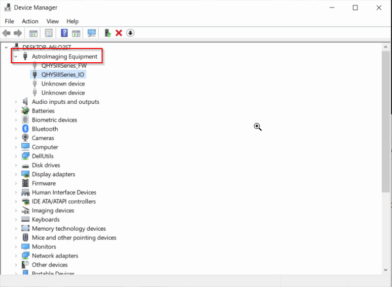

自 N.I.N.A. 1.11 起，N.I.N.A. 内置了版本 21.3.13.17 的 QHY SDK。从这个 SDK 版本开始，您需要确保 QHY USB 驱动已通过安装最新的 QHY 驱动 All-in-One 包至少更新到 21.2.20 版本或更高。这是因为 N.I.N.A. 附带的 QHY SDK 版本与 QHY USB 驱动中有部分 Cypress FX3 IO 库已更新，两者必须保持同步。

为帮助满足此要求，这些版本信息显示在设备 > 相机界面中。此外，如果检测到驱动版本低于 2.1.20，N.I.N.A. 将发出警告级别的通知：

此次更新的好处包括改进的 USB 错误恢复能力。
*此要求不适用于具有 USB2 接口的相机（CCD、A 系列和 QHY5II 1.25" 相机）。*

### 如果遇到 USB 驱动更新问题
有些用户在更新 USB 驱动时遇到问题，看起来驱动更新似乎没有生效。如果遇到此情况，可以尝试以下方法：

1. 在相机**断开连接**的情况下，右键点击开始菜单并打开设备管理器

2. 进入查看菜单，选择显示隐藏的设备

3. 展开天文成像设备部分

4. 右键点击 **QHY5IIISeries_FW**，选择*属性*，然后进入*驱动程序*标签页
5. 按下*更新驱动程序*按钮，选择*自动搜索驱动程序*
6. 对 **QHY5IIISeries_IO** 设备同样执行步骤 4 和 5
7. 连接相机。验证它运行的是较新的设备驱动版本

完成上述步骤后，如果没有更深层次的问题，相机的驱动和固件加载器应该已更新到安装的版本。QHY 已知晓此问题并正在处理中。