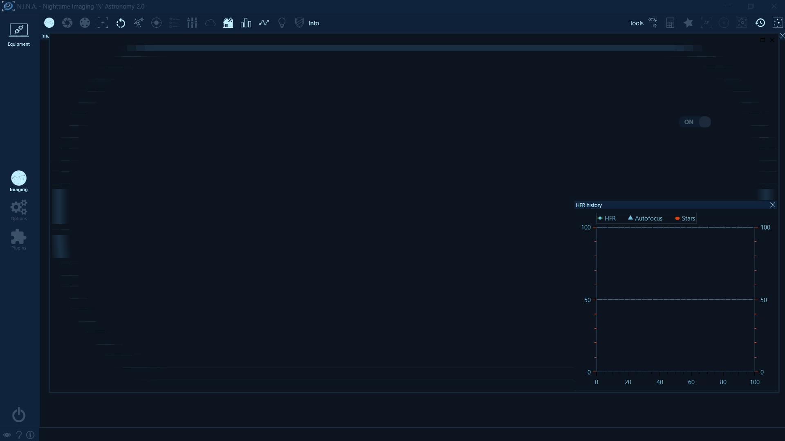
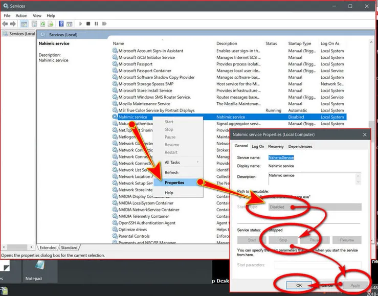

# 显示问题

## 使用远程访问时出现空白屏幕
当您在使用远程访问软件时遇到 N.I.N.A. 显示空白屏幕，很可能是由于目标计算机未连接任何屏幕导致。由于 N.I.N.A. 是硬件加速的，而 Windows 在没有显示器连接时不会渲染任何硬件加速的内容，因此应用程序将仅显示空白屏幕。
要绕过此问题，您可以在 N.I.N.A. 中禁用硬件加速，方法是导航到 选项 > 通用 > 高级 > 硬件加速 并将其设为关闭。重启后，应用程序在使用远程访问软件时应正常显示。

## 显示伪影和缺失图形

过去有报告称应用程序渲染不正确。如果您的应用程序看起来像下面的窗口，图标消失且窗口无法渲染，请按照本指南操作：

已确认有一个名为"Nahimic service"的音频驱动服务导致 WPF 应用程序出现副作用（WPF 是 N.I.N.A. 基于的用户界面框架）。
一旦停止此服务，应用程序将恢复正常渲染。

要禁用此服务：
- 通过按住 `⊞ Win` + `r` 键打开 Windows 运行菜单
- 在窗口中输入"services.msc"并按"确定"
- 将打开一个新窗口，显示所有可用服务
- 找到名为"Nahimic Service"的服务，按下方截图中的步骤操作

