# 设备列表

本页面为**广州外国语学校天文台**核心观测设备清单及详细参数，用于天文观测、天体摄影与科普教学。文中若有标注如[1](#设备列表)角标的，说明该内容存疑或有特殊说明，请注意确认。

经纬仪的参数在对应望远镜套装中列出

如无特别说明，后文所述的**天文台主镜**均指校内顶楼天文台圆顶中的[**RC14**](#gso-rc14)望远镜

---

## 🔭 望远镜

:::info

此标注“🧰”是指该望远镜为套装（包含赤道仪等），除此以外，本栏所示设备仅为**主镜**，不包含图中的赤道仪等其他配件

:::

### GSO[^1] RC14

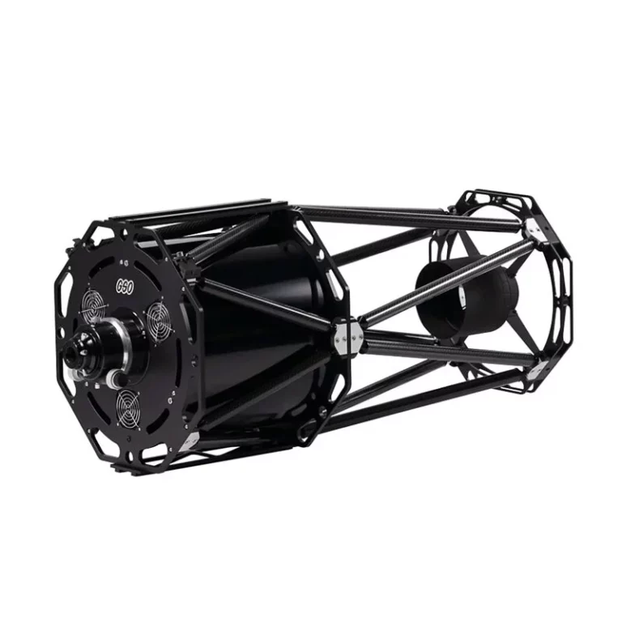

:::info

**GSO[^1]RC14** 采用经典RC 里奇-克雷蒂安（Ritchey-Chrétien）光学系统，使用两个反射镜面，没有折射镜，减少了光量的损失，且无彗差、无球差，提供平坦的大视场与优异的像质，作为天文台主镜。

:::

| 参数 | 规格 |
|:---|:---|
| **光学系统** | RC 里奇-克雷蒂安 (Ritchey-Chrétien) |
| **口径** | 355 mm（14 英寸） |
| **焦距** | 约 2845 mm |
| **焦比** | f/8 |
| **分辨率** | 0.32 角秒 |

### 🧰Celestron CPC 800 GPS (XLT)

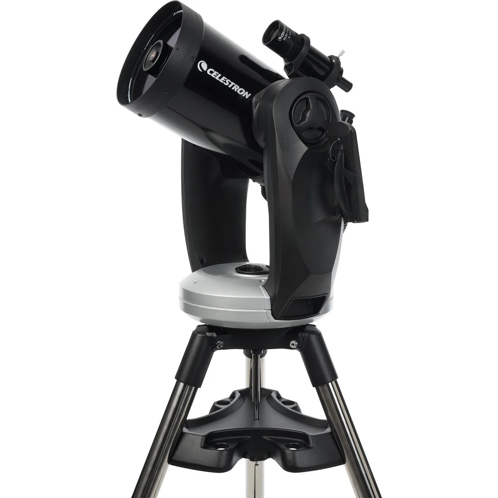

:::tip

这套望远镜出现在了特伦斯·迪金森的 **《夜观星空》** [^4]的观星器材章节中

:::

| 参数         | 规格               |
| :----------- | :----------------- |
| **光学系统** | SC 施密特-卡塞格林 |
| **口径**     | 203.2 mm（8 英寸） |
| **焦距**     | 2032 mm（80 英寸） |
| **焦比**     | f/10               |
| **瑞利判据** | 0.69 角秒          |
| **极限星等** | 14                 |

**经纬仪参数**

| 参数                           | 规格                                                         |
| ------------------------------ | ------------------------------------------------------------ |
| 支架类型                       | 计算机化双叉臂经纬仪                                         |
| 高度调节范围（含支架和三脚架） | 1295.4 mm - 1422.4 mm（51英寸 - 66英寸）                     |
| 三脚架腿管径                   | 50.8 mm（2英寸）不锈钢                                       |
| 支架头重量（含光学镜筒）       | 42 lbs（19.1 kg）                                            |
| 附件托盘                       | 是                                                           |
| 三脚架重量                     | 19 lbs（8.6 kg）                                             |
| 回转速度                       | 9档回转速度 - 最高速度5°/秒                                  |
| 跟踪速率                       | 恒星速、太阳速和月球速                                       |
| 跟踪模式                       | 地平式、赤道仪北向、赤道仪南向                               |
| GPS                            | 内置16通道                                                   |
| 鸠尾槽兼容性                   | 无                                                           |
| 辅助端口数量                   | 2个AUX端口（手控器可使用任意AUX端口）                        |
| 自动导星接口                   | 是                                                           |
| USB端口                        | 是，位于手控器上                                             |
| 电源要求                       | 12V DC，1.5A（插头尖端为正极）                               |
| 电机驱动                       | 直流伺服电机                                                 |
| 校准程序                       | 星空校准、自动双星校准、双星校准、太阳系校准、EQ北校准、EQ南校准 |
| 周期误差校正                   | 是                                                           |
| 计算机化手控器                 | 2行×18字符背光液晶显示屏，19个LED背光按键，USB 2.0端口用于电脑连接 |
| NexStar+ 数据库                | 40,000+个天体，100个用户自定义可编程天体。超过200个天体的增强信息 |
| 软件                           | Celestron Starry Night特别版软件与SkyPortal App              |
| 望远镜套件总重                 | 61 lbs（27.6 kg）                                            |
| 随附物品                       | 光学镜筒、支架与三脚架、附件托盘、40mm目镜、1.25英寸天顶镜、50mm 9x50寻星镜（含支架）、使用说明书 |

### 🧰Celestron Advanced VX 8"

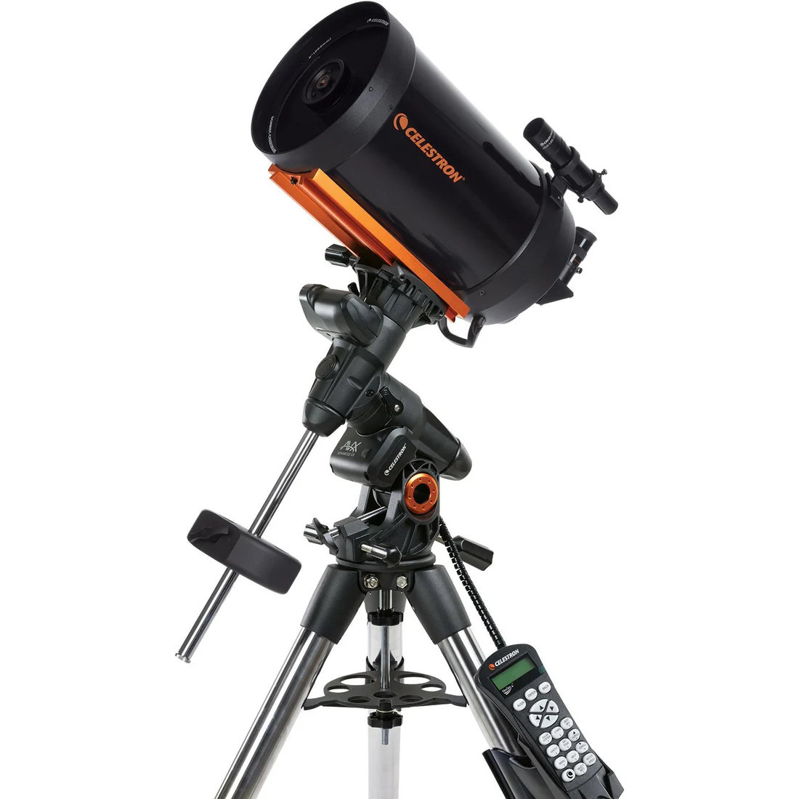

:::info

实际上，本台望远镜的光学参数与[Celestron CPC 800 GPS (XLT)](#🧰Celestron CPC 800 GPS (XLT))几乎完全一致

本台望远镜的寻星镜支架是损坏的

:::

| 参数         | 规格               |
| :----------- | :----------------- |
| **光学系统** | SC 施密特-卡塞格林 |
| **口径**     | 203.2 mm（8 英寸） |
| **焦距**     | 2032 mm（80 英寸） |
| **焦比**     | f/10               |
| **瑞利判据** | 0.69 角秒          |
| **极限星等** | 14                 |

### 🧰Celestron NexStar 4SE

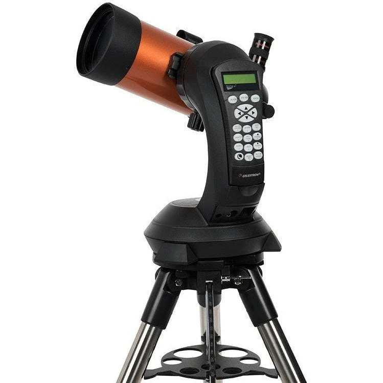

| 参数         | 规格                   |
| :----------- | :--------------------- |
| **光学系统** | MC 马克苏托夫-卡塞格林 |
| **口径**     | 102 mm（4.02 英寸）    |
| **焦距**     | 1325 mm（52 英寸）     |
| **焦比**     | f/13                   |
| **瑞利判据** | 1.37 角秒              |
| **极限星等** | 12.5                   |

**经纬仪参数**

| 参数                           | 规格                                                         |
| ------------------------------ | ------------------------------------------------------------ |
| 支架类型                       | 电脑化地平式单叉臂经纬仪                                     |
| 仪器承载能力                   | 10 lbs (4.54 kg)                                             |
| 高度调节范围（含支架及三脚架） | 939.8 mm - 2397 mm (37" – 55")                               |
| 三脚架腿直径                   | 38.1 mm (1.5") 不锈钢                                        |
| 支架头重量                     | 7 lbs (3.2 kg)                                               |
| 附件盘                         | 有                                                           |
| 三脚架重量                     | 10 lbs (4.54 kg)                                             |
| 转动速度                       | 9档转动速度 - 最高速度3°/秒                                  |
| 跟踪速率                       | 恒星速、太阳速和月球速                                       |
| 跟踪模式                       | 地平式（Alt-Az）、北半球赤道式及南半球赤道式                 |
| GPS                            | 不适用                                                       |
| 鸠尾板兼容性                   | CG-5鸠尾板                                                   |
| 辅助端口数量                   | 1个AUX端口                                                   |
| 自动导星接口                   | 无                                                           |
| USB端口                        | 有，用于手控器输入                                           |
| 电源要求                       | 8节AA电池（不含）及12 VDC 750 mA（尖端为正极）               |
| 电机驱动                       | 直流伺服电机                                                 |
| 校准程序                       | SkyAlign、一星校准、二星校准、自动二星校准、太阳系天体校准、EQ North / EQ South校准（赤道仪校准需使用赤道楔） |
| 周期误差校正                   | 无                                                           |
| 电脑化手控器                   | 双行18字符液晶显示屏，配备19个光纤背光LED按键                |
| NexStar+ 数据库                | 可访问38,181个天体，其中超过200个天体拥有增强信息            |
| 软件                           | Celestron Starry Night特别版软件及SkyPortal App              |
| 套件总重量                     | 23 lbs (10.4 kg)                                             |
| 随附物品                       | 光学镜筒 单叉臂支架及三脚架 附件盘 Star Pointer寻星镜 内置楔座 NexStar+手控器 25mm目镜 |

### 🧰Celestron Deluxe 80EQ

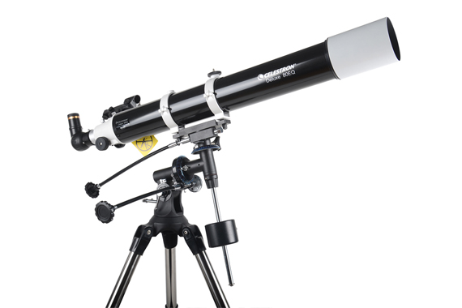

| 参数         | 规格              |
| :----------- | :---------------- |
| **光学系统** | 折射式            |
| **口径**     | 80 mm（3.1 英寸） |
| **焦距**     | 900 mm            |
| **焦比**     | f/11.2            |
| **瑞利判据** | 1.73 角秒         |
| **极限星等** | 12                |

### 🧰Celestron INSPIRE天启CG3 Pro 80900

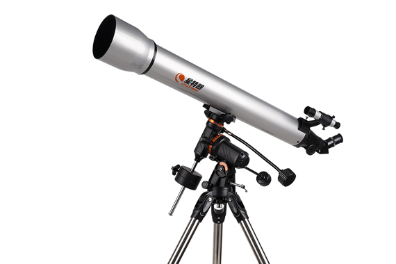

| 参数         | 规格              |
| :----------- | :---------------- |
| **光学系统** | 消色差折射式      |
| **口径**     | 80 mm（3.1 英寸） |
| **焦距**     | 900 mm            |
| **焦比**     | f/11.2            |
| **瑞利判据** | 1.73 角秒         |
| **极限星等** | 12                |

### 🧰ACUTER 小蓝马70

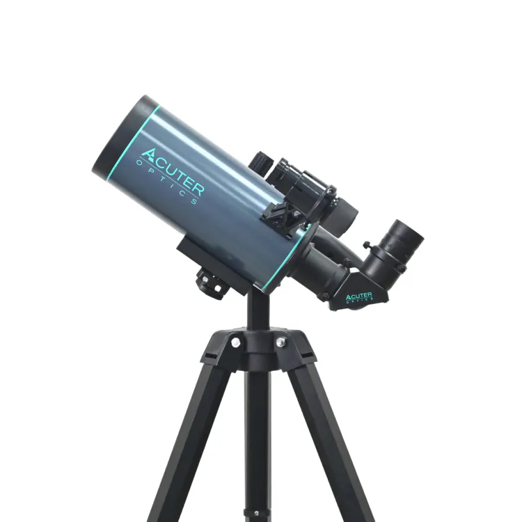

| 参数                 | 规格                   |
| :------------------- | :--------------------- |
| **光学系统**         | MC 马克苏托夫-卡塞格林 |
| **口径**             | 70 mm                  |
| **焦距**             | 1000 mm                |
| **焦比**             | f/14.2                 |
| **瑞利判据**         | 1.98 角秒              |
| **极限星等（估算）** | 11.7                   |

### Seestar S50

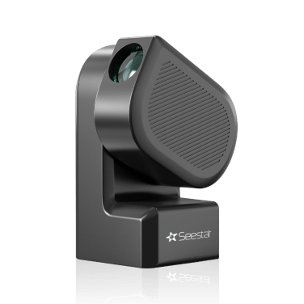

:::info

Seestar S50或许是本栏最特殊的存在。天文馆存有 3 台[^2]。以下列出部分参数：

:::

| 参数         | 规格                                        |
| ------------ | ------------------------------------------- |
| 光学类型     | 3片式复消色差APO（折射式）                  |
| 传感器       | IMX462                                      |
| 分辨率       | 1/2.8'' 1920 × 1080                         |
| 有效光学口径 | 50 mm                                       |
| 光学焦距     | 250 mm                                      |
| 焦比         | f/5                                         |
| 视场角       | 0.72° × 1.28°                               |
| 存储容量     | 64 GB                                       |
| 内置滤镜     | UV/IR CUT滤镜 双窄带滤镜 暗场滤镜 |

---

## **🌐** 赤道仪

### iOptron CEM120

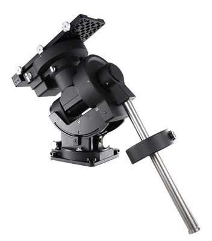

我校天文台选用 iOptron CEM120 中心平衡式赤道仪，它以革命性的“重心居中”设计带来天然的高稳定性与极低振动，并实现 **±3.5 角秒** 的优异周期性跟踪误差，可从容支持长时间深空摄影。整机最高能承载重达 52 kg 的大型望远镜及成像终端，刚性与精度兼备。内置 Wi-Fi 与有线网口，配合精密离合、线缆管理系统和免极星对极轴程序，为远程控制与日常操作提供专业、可靠的保障，是兼顾目视与科研摄影的高品质核心平台。其参数如下（来自iOptron官网）：

| 参数                               | 规格                                                         |
| ---------------------------------- | ------------------------------------------------------------ |
| 类型                               | 中心平衡式赤道仪 (CEM)                                       |
| 有效载荷1               | 52 kg（115 lbs），不含平衡重锤                               |
| 赤道仪重量                         | 26 kg（57 lbs）                                              |
| 有效载荷/赤道仪重量比              | 2                                                            |
| 材质                               | 全金属                                                       |
| 纬度调节范围2           | 0°~ 68°（0.5角分刻度）                                       |
| 方位调节范围                       | ± 5°（3角分刻度）                                            |
| 周期误差（编码器测得）3 | < ±3.5角秒                                                   |
| 蜗杆周期                           | 240秒                                                        |
| 周期误差校正                       | 永久周期误差校正 (PPEC)                                      |
| 赤经蜗轮                           | Φ216 mm，360齿，零背隙                                       |
| 赤纬蜗轮                           | Φ216 mm，360齿，零背隙                                       |
| 蜗杆                               | Φ26 mm                                                       |
| 赤经轴                             | Φ80 mm，钢制                                                 |
| 赤纬轴                             | Φ80 mm，钢制                                                 |
| 赤经轴承                           | Φ125 mm                                                      |
| 赤纬轴承                           | Φ125 mm                                                      |
| 平衡重锤杆                         | Φ38.1 x 540 mm（不锈钢，防滑，重4.5 kg）                     |
| 平衡重锤                           | 10 kg（22 lbs）                                              |
| 赤道仪底座尺寸                     | 210 x 230 mm                                                 |
| 电机驱动                           | 精密步进电机，128微步驱动                                    |
| 步进精度                           | 0.07角秒                                                     |
| 最大回转速度                       | 4°/秒（960倍速）                                             |
| 手控器                             | Go2Nova® 8410，8行21字符液晶屏                               |
| 电源要求4               | 直流12V，5A                                                  |
| 功耗                               | 0.7A（跟踪），1.8A（GOTO）                                   |
| 极轴镜                             | 可选配 iPolar 电子极轴镜                                     |
| 中天处理                           | 停止（0-14°过中天），自动翻转                                |
| 零位                               | 自动搜索零位                                                 |
| 停放位置                           | 水平、垂直、当前、高度/方位角输入                            |
| 水平指示器                         | 有                                                           |
| 鸠尾槽                             | Losmandy D 型                                                |
| GPS                                | 有                                                           |
| 导星接口                           | ST-4                                                         |
| 通讯接口                           | RS232、USB、LAN、WiFi                                        |
| 线缆管理                           | 2×DC12V (1A)、2×DC (5A)、ST4、6P6C、2×USB2.0、3×USB3.0、iPolar用USB、AUX |
| 工作温度                           | -10°C ~ +40°C                                                |
| 立柱/三脚架                        | 可选配立柱                                                   |
| 保修                               | 两年有限保修                                                 |

**注释：**

1. 取决于光学镜筒（OTA）的尺寸和长度。
2. 如果您所在纬度低于10°，请联系 iOptron 购买低纬度重锤（#7326LL）。
3. 在测试台上用编码器测得，周期240秒。
4. 随附的交流适配器仅供室内使用。
5. #7320 的毛重及尺寸：79.4 lbs，24.5 x 21.75 x 13.75 英寸。
6. #7326 的毛重及尺寸：24.25 lbs，11.75 x 11 x 5.5 英寸。

### SkyWatcher HEQ5 PRO

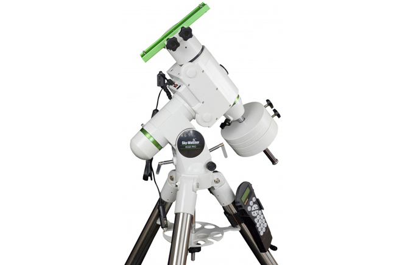

| 参数       | 规格                        |
| ---------- | --------------------------- |
| 支架类型   | 德式赤道仪                  |
| 有效载荷   | 13.7 kg                     |
| 三脚架高度 | 97-121 cm                   |
| 导星速度   | 0.25X、0.50X、0.75X 或 1X   |
| 重锤       | 2 × 5.1 kg                  |
| 附件盘     | 大型全覆盖式                |
| 电机驱动   | 1.8度步进电机               |
| GOTO系统   | SynScan手控器               |
| 三脚架重量 | 5.6 kg，1.75 英寸钢制三脚架 |
| 运输重量   | 18+12 kg                    |
| 运输尺寸   | 127×24×25 cm³；44×44×19 cm³ |
| 回转速度   | 最高 3.4°/秒（800倍速）     |

### Celestron Advanced VX

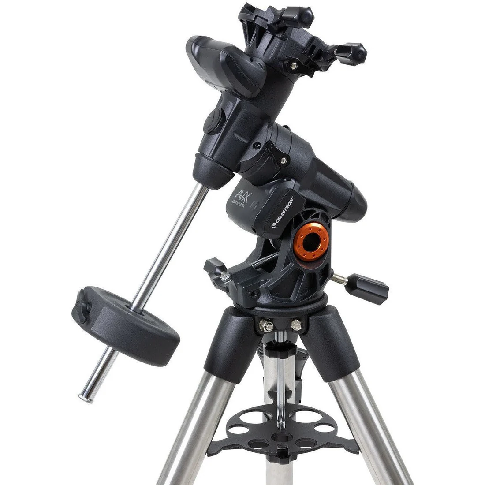

| 参数                          | 规格                                                         |
| :---------------------------- | :----------------------------------------------------------- |
| 支架类型                      | 电脑化德式赤道仪                                             |
| 仪器负载能力                  | 30 lbs (13.6 kg)                                             |
| 高度调节范围 (含本体和三脚架) | 1118 mm - 1626 mm (44" – 64")                                |
| 三脚架脚管直径                | 50.8 mm (2") 不锈钢                                          |
| 纬度调节范围                  | 7° - 77°                                                     |
| 赤道仪本体重量                | 17 lbs (7.71 kg)                                             |
| 附件盘                        | 有                                                           |
| 三脚架重量                    | 18 lbs (8.16 kg)                                             |
| 重锤重量                      | 1 x 12 lbs                                                   |
| 回转速度                      | 9档回转速度 - 最高速度 4°/秒                                 |
| 跟踪速率                      | 恒星速、太阳速和月球速                                       |
| 跟踪模式                      | 北半球赤道仪模式与南半球赤道仪模式                           |
| GPS                           | 不支持                                                       |
| 燕尾槽兼容性                  | 双鞍板 (兼容CG-5和CGE燕尾板)                                 |
| 辅助接口数量                  | 3个AUX接口 (1个用于手控器，2个AUX接口用于可选配件)           |
| 自动导星接口                  | 有                                                           |
| USB接口                       | 有，位于手控器上                                             |
| 电源要求                      | 12V DC 3.5A (插头尖端为正极)                                 |
| 电机驱动                      | 直流伺服电机                                                 |
| 校准流程                      | 2星校准、1星校准、太阳系天体校准、上次校准、快速校准         |
| 周期误差校正                  | 支持                                                         |
| 电脑化手控器                  | NexStar+手控器，带LCD显示屏，19个光纤背光LED按键             |
| NexStar+数据库                | 40,000+个天体，100个用户自定义可编程天体。超过200个天体提供增强信息。 |
| 软件                          | Celestron Starry Night特别版软件 \| SkyPortal App            |
| 套件总重量                    | 47 lbs (21.31 kg)                                            |
| 随附物品                      | Advanced VX 赤道仪本体 \| 三脚架 \| 附件盘 \| 1个12 lbs重锤 \| NexStar+手控器 \| 直流电源线 (插入点烟器插座) |

### Celestron CG3 Pro 德式赤道仪

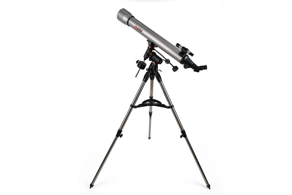

### SkyWatcher EQ3

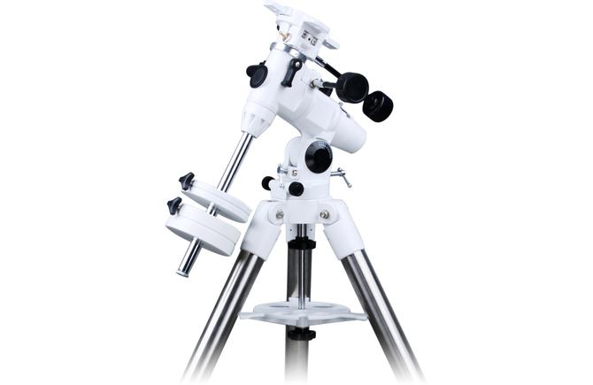

| 参数     | 规格              |
| -------- | ----------------- |
| 支架类型 | 德式赤道仪        |
| 有效载荷 | 5.5 kg            |
| 微调控制 | 是                |
| 平衡重锤 | 2 x 5.1 kg        |
| 附件托盘 | 大型全覆盖式      |
| 运输重量 | 25 kg             |
| 运输尺寸 | 104 x 45 x 26 cm³ |

### SkyWatcher EQ3D

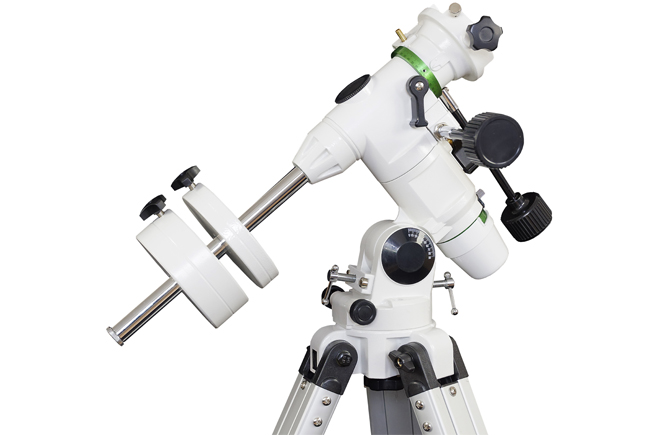

| 参数     | 规格                    |
| -------- | ----------------------- |
| 支架类型 | 德式赤道仪              |
| 有效载荷 | 5.5 kg                  |
| 微调控制 | 是                      |
| 平衡重锤 | 1.8 + 3.42 kg 或 5.1 kg |
| 附件托盘 | 大型全覆盖式            |
| 电机驱动 | 无                      |
| 运输重量 | 15 kg                   |
| 运输尺寸 | 89 x 45 x 27 厘米       |

## 📷 相机

### ZWO ASI6200MM PRO

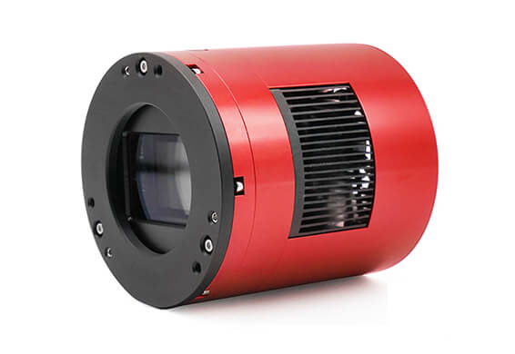

:::info

振旺旗舰级黑白深空相机，合成彩色照片需要搭配[2英寸LRGB滤镜](#⚙️配件)拍摄。天文馆存有 2 台，一台连接在天文台主镜RC14上。

:::

| 参数 | 规格 |
|:---|:---|
| 传感器 | Sony 背照式全画幅 IMX455 传感器 |
| 分辨率 | 61.17MP 9576 × 6388 |
| 像素尺寸 | 3.76 μm × 3.76 μm |
| 靶面尺寸 | Full frame 36 mm x 24 mm |
| 传输速度 | 6.3 FPS |
| 读出噪声 | 0.86e |
| QE % | 91% |
| 满阱 | 51400e |
| ADC | 16 bit |
| 制冷 | 30℃~35℃ below ambient |
| DDR3 缓存 | 512 MB |

### ZWO ASI585MC

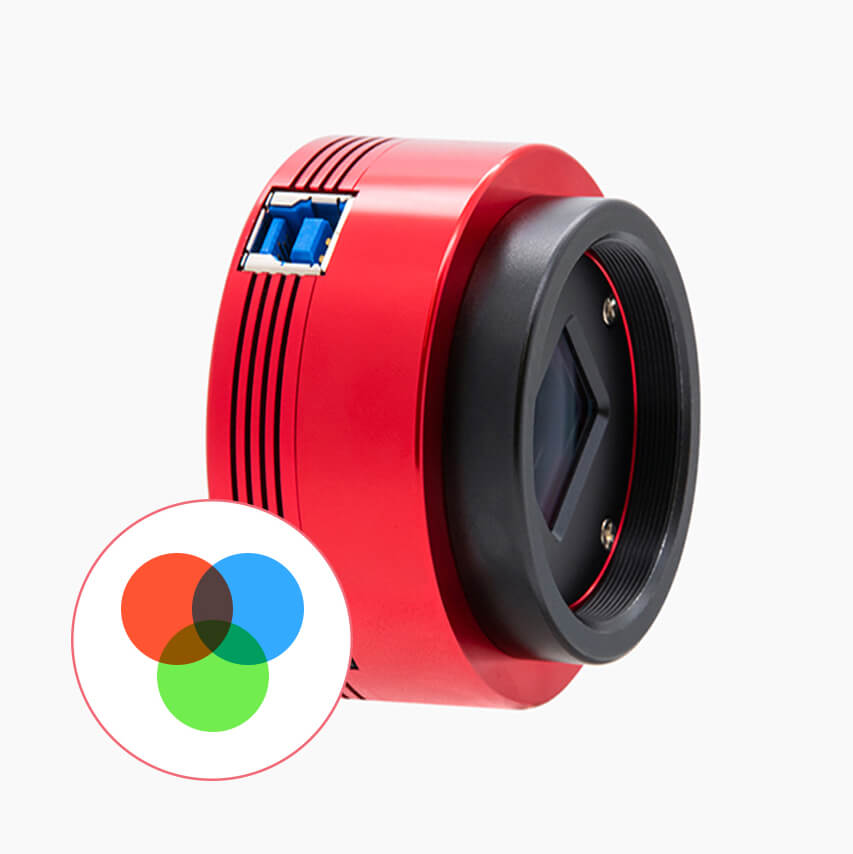

:::info

振旺行星相机，天文馆存有 3 台[^2]

:::

| 参数     | 规格                     |
| :------- | :----------------------- |
| 传感器   | Sony IMX585 传感器       |
| 分辨率   | 8.29MP 3840 × 2160       |
| 像素尺寸 | 2.9 μm × 2.9 μm          |
| 靶面尺寸 | 1/1.2'' 11.2 mm x 6.3 mm |
| 传输速度 | 46.9 FPS                 |
| 读出噪声 | 0.7e                     |
| QE %     | 88%                      |
| 满阱     | 40Ke                     |
| ADC      | 12 bit                   |

### ZWO ASI220MM Mini

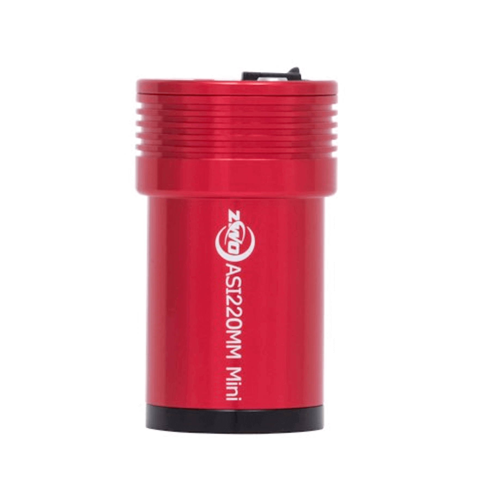

:::info

振旺导星相机，天文馆存有 2 台[^2]

:::

| 参数     | 规格                      |
| :------- | :------------------------ |
| 传感器   | SC2210                    |
| 分辨率   | 1920 × 1080               |
| 靶面尺寸 | 1/1.8'' 7.68 mm x 4.32 mm |
| 传输速度 | 14 FPS                    |
| 读出噪声 | 0.6e                      |
| QE %     | 92%                       |
| 满阱     | 8.78Ke                    |
| ADC      | 12 bit                    |
| 像素大小 | 4 μm × 4 μm               |

---

## ⚙️ 配件

:::info

由于统计问题，本栏目并**没有列出所有的配件**。下文所示**主镜使用**指的是该配件正安装在天文台主镜上。

:::

| 名称   | 规格                      | 备注                   | 图片                    |
| :------- | :------------------------ | -------- | -------- |
|Celestron Ultra Wide 超广角目镜组|6mm 9mm 15mm 20mm 表观视场 66°||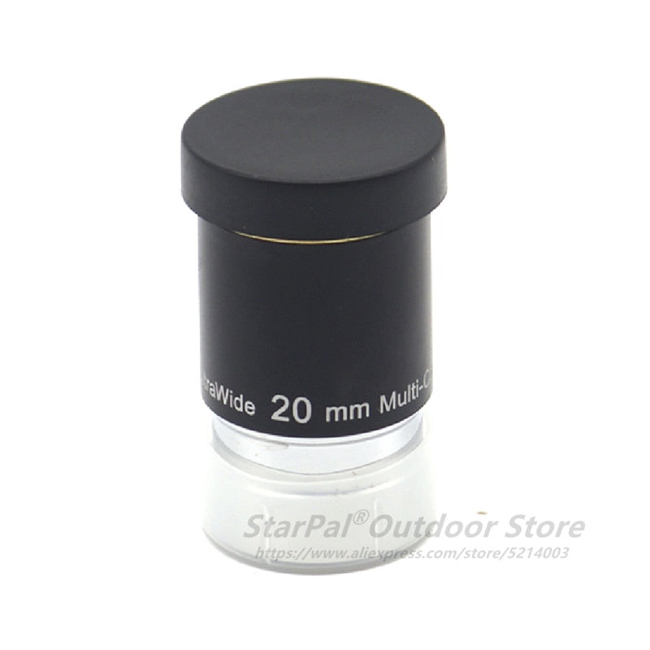|
|天虎光学1.25英寸赫歇尔太阳滤镜|||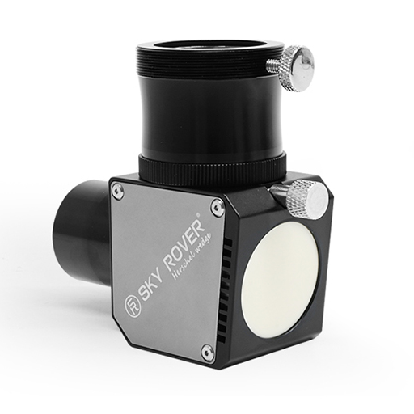|
|ZWO ASIAIR Plus||||
|ZWO CAA||主镜使用||
|ZWO EFW||主镜使用||
|ZWO EFW mini||||
|ZWO OAG||||
|ZWO OAG-L||主镜使用||
|ZWO LRGB|1.25英寸 2英寸[^3]|主镜使用||
|ZWO IRCut|1.25英寸|||

[^1]: 暂未确认品牌方是否为GSO
[^2]: 粗略统计，实际数量可能更多
[^3]: 实际上天文馆内只找到了1.25英寸的LRGB滤镜，猜测主镜正在使用的可能是2英寸的LRGB滤镜
[^4]: 指《夜观星空》2012年版
