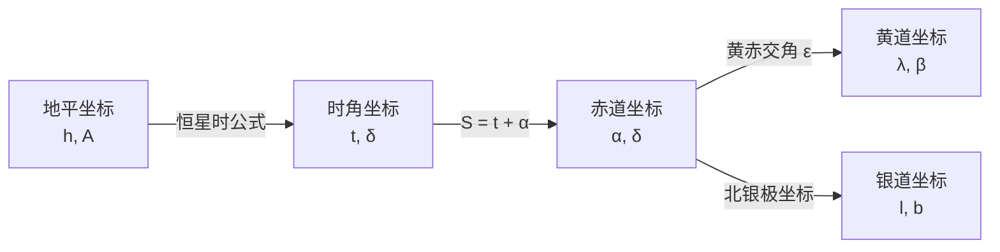

# 天球坐标系

天球坐标系是天文学中用来描述天体在天球上位置的球面坐标系统。就像我们在地球上使用经纬度来定位城市一样，天文学家使用天球坐标来精确定位天空中的恒星、行星、星系等天体[^1][^2][^4]。

import Tabs from '@theme/Tabs';
import TabItem from '@theme/TabItem';

---

## 从地理坐标到天球坐标

在地球上，我们用**经纬度**来定位任何一个地点——纬度是从赤道面量的线面角，经度是从本初子午线量的两面角。地理坐标系我们已经很熟悉了。

天球坐标系本质上是同一套思路搬到了天上：把地球的经纬度系统投影到天球上，用类似的"纬度"和"经度"来标记天体在天球上的位置。不同的坐标系只是选择了不同的"赤道面"和"本初子午线"作为参考而已。

- **地理坐标 → 赤道坐标**：地球赤道 → 天赤道，本初子午线 → 春分点方向，地表经纬度 → 赤经赤纬
- **观测者 → 地平坐标**：观测者头顶 → 天顶，当地子午线 → 南北点，仰角方位角 → 高度角方位角

理解了这层对应关系，后面每个坐标系就只是"换了谁当赤道、换了谁当本初子午线"的问题。

## 天球的基本概念

在正式开始之前，我们需要先了解**天球**的概念。

**天球**是一个以观测者（或地心、日心）为中心、半径无限大的假想球体。所有天体都被投影到这个球体的球面上，天体的位置用其在天球上的投影位置来表示。天球是位置天文学中一个极为重要的辅助工具[^1]。

### 天球上的基本点和圈

*▲ 天球是一个假想的球体，地球赤道、黄道、天极等关键要素都投影在天球上。*

- **天顶（Zenith）**：观测者头顶正上方的点
- **天底（Nadir）**：观测者脚下正下方的点，与天顶相对
- **天赤道（Celestial Equator）**：地球赤道平面与天球相交的大圆，将天球分为北天半球和南天半球
- **北天极 / 南天极（Celestial Poles）**：地球自转轴延伸与天球的交点。北天极位于地球北极正上方，是天空中的一个固定点，所有星星看起来都围绕它逆时针旋转
- **黄道（Ecliptic）**：地球公转轨道平面与天球相交的大圆。由于地轴倾斜约 23.5°，黄道与天赤道之间存在约 **23°26'** 的夹角，这个角度称为**黄赤交角**
- **春分点（Vernal Equinox, ♈）**：太阳在春分时从天赤道以南穿过天赤道到达以北的交点，是天球坐标系中最关键的参考点
- **秋分点（Autumnal Equinox）**：太阳在秋分时从天赤道以北穿过天赤道到达以南的交点

:::info[黄赤交角]

黄赤交角的精确值为 **ε = 23°26′21.406″**（J2000.0 历元，IAU 2000 最佳估值）。由于行星摄动，这一数值在约 22.1° 至 24.5° 之间以约 41,000 年的周期缓慢变化。

:::

以下概念贯穿所有天球坐标系，先理解它们有助于后续学习：

| 名称 | 定义 | 几何意义 | 涉及的坐标系 |
|:-----|:-----|:---------|:-----------|
| **地平圈** | 过天球中心、垂直于天顶-天底连线的平面与天球相交的大圆 | 即观测者的"水平面"在天球上的投影，将天球分为可见半球和不可见半球 | 地平坐标系（作为基本圈） |
| **天顶（Z）** | 观测者头顶正上方的点 | 地平圈的几何极；铅垂线向上与天球的交点 | 地平坐标系（作为极） |
| **天底（Z'）** | 观测者脚下正下方的点 | 天顶的对径点；铅垂线向下与天球的交点 | 地平坐标系 |
| **北点** | 地平圈上正北方向的点 | 子午圈与地平圈在北方的交点；从北点顺时针量度方位角（天文学惯例） | 地平坐标系（作为原点） |
| **南点** | 地平圈上正南方向的点 | 子午圈与地平圈在南方的交点；北点的对径点。测量学惯例以南点为方位角原点 | 地平坐标系 |
| **东点 / 西点** | 地平圈上正东/正西方向的点 | 天赤道与地平圈的交点（卯酉圈与地平圈的交点）。天赤道在地平圈以上部分的中点分别为东点和西点 | 地平坐标系 |
| **子午圈** | 过天顶、天底和两天极的大圆 | 即观测者的"经线"在天球上的投影；将天球分为东半球和西半球 | 地平坐标系、时角坐标系 |
| **地平经圈（垂直圈）** | 过天顶、天底和某一天体的大圆 | 类似于地球上的经线。有无数个，每个天体对应一条地平经圈 | 地平坐标系（作为副圈） |
| **卯酉圈** | 过天顶、天底和东点、西点的大圆 | 垂直于子午圈的地平经圈，即观测者的"东西线"在天球上的投影 | 地平坐标系 |
| **天赤道** | 地球赤道平面与天球相交的大圆 | 将天球分为北天半球和南天半球 | 时角坐标系、赤道坐标系（作为基本圈） |
| **北天极（P）/ 南天极（P'）** | 地球自转轴延伸与天球的交点 | 天赤道的几何极；北天极附近有北极星。所有天体绕天极做周日视运动 | 时角坐标系、赤道坐标系（作为极） |
| **上点 Q** | 天赤道在子午圈上的交点中，位于地平圈以上的那个点 | 即天赤道与观测者子午圈在天赤道以上的交点；天体中天时经过此点附近 | 时角坐标系（作为原点） |
| **下点 Q'** | 天赤道在子午圈上的交点中，位于地平圈以下的那个点 | 上点 Q 的对径点 | 时角坐标系 |
| **时圈（赤经圈）** | 过两天极和某一天体的大圆 | 类似于地球上的经线。有无数个，每个天体对应一条时圈 | 时角坐标系、赤道坐标系（作为副圈） |
| **春分点（♈）** | 黄道与天赤道的两个交点之一，太阳由南向北穿过天赤道的点 | 天球坐标系中最重要的参考点，是赤道坐标系和黄道坐标系的共同原点 | 赤道坐标系、黄道坐标系（作为原点） |
| **秋分点** | 黄道与天赤道的两个交点之一，太阳由北向南穿过天赤道的点 | 春分点的对径点 | 赤道坐标系、黄道坐标系 |
| **黄道** | 地球公转轨道平面与天球相交的大圆 | 太阳在天球上的周年视运动轨迹；与天赤道夹角约为 23°26'（黄赤交角） | 黄道坐标系（作为基本圈） |
| **北黄极 / 南黄极** | 黄道的几何极 | 垂直于黄道面的直线与天球的交点；北黄极位于天龙座方向 | 黄道坐标系（作为极） |
| **黄经圈** | 过黄极和某一天体的大圆 | 垂直于黄道面的半个大圆 | 黄道坐标系（作为副圈） |
| **银道** | 银河系盘面的平均平面与天球相交的大圆 | 银河在天空中的中线；太阳系位于银道面附近 | 银道坐标系（作为基本圈） |
| **北银极 / 南银极** | 银道的几何极 | 北银极位于后发座方向，赤经约 12h 51m，赤纬约 +27° | 银道坐标系（作为极） |
| **银心方向** | 银河系中心在天球上的投影方向 | 位于人马座方向；银经从银心方向起算 | 银道坐标系（作为原点） |
| **银经圈** | 过银极和某一天体的大圆 | 垂直于银道面的半个大圆 | 银道坐标系（作为副圈） |

> **理解要点**：天球坐标系的基本结构都遵循同一模式——一个大圆（基本圈）将天球一分为二，两个极点垂直于基本圈，一个参考点（原点）定在基本圈上，再通过无数条副圈（经圈）连接极点与基本圈上的各点，构成完整的坐标网格。

---

## 球面坐标系的构成要素

每一个天球坐标系都由以下基本要素构成[^1]：

| 要素 | 说明 | 类比地理坐标 |
|:-----|:-----|:-----------|
| **基本圈（基圈）** | 坐标系的基础大圆，将天球分为两个半球 | 地球赤道 |
| **极** | 基本圈的几何极点 | 南北极 |
| **原点（主点）** | 基本圈上的参考起点 | 本初子午线与赤道的交点 |
| **副圈** | 过极的大圆 | 经线 |
| **第一坐标（纬度坐标）** | 沿副圈从基本圈量起的角距离 | 纬度 |
| **第二坐标（经度坐标）** | 沿基本圈从原点量起的角距离 | 经度 |

---

## 一、地平坐标系

**Horizon Coordinate System · Alt-Azimuth System**

地平坐标系是最直观的天球坐标系，它直接基于观测者所在地的地平线来定位天体[^1][^2]。

### 基本结构

| 项目 | 内容 |
|:-----|:-----|
| **基本圈** | 地平圈（观测者的真地平圈） |
| **极** | 天顶（Z）和天底（Z'） |
| **原点** | 北点（天文学惯例）或南点（测量学惯例） |
| **副圈** | 地平经圈（垂直圈）——过天顶、天底和天体的半个大圆 |

### 坐标定义

- **高度角（Altitude）** $h$：天体与观测者连线与地平圈的夹角（线面角），沿地平经圈量度
  - 范围：$0° \to +90°$（地平→天顶），$0° \to -90°$（地平→天底）
  - **天顶距（Zenith Distance）** $z = 90° - h$
- **方位角（Azimuth）** $A$：从天球子午圈与天体地平经圈的夹角（两面角），从北点沿地平圈顺时针量度
  - 范围：$0° \to 360°$
  - $A = 0°$：正北 | $A = 90°$：正东 | $A = 180°$：正南 | $A = 270°$：正西

*▲ 地平坐标系以观测者为中心，使用高度角（h）和方位角（A）来定位天体。*

### 特点

- ✅ **直观易用**：直接对应观测者的实际视野，适合目视观测和业余天文
- ❌ **因时因地而异**：同一时刻不同地点的观测者看到的同一颗星，其地平坐标不同；同一地点不同时刻同一颗星的坐标也不同
- ❌ **不适用于星表**：由于坐标随时间地点变化，星表不能使用地平坐标来记录天体位置

### 应用场景

- 业余天文观测和天体导航
- 望远镜的经纬仪（Alt-Az）架台控制
- 建筑日照分析和太阳能板朝向设计

---

## 二、时角坐标系（第一赤道坐标系）

**Hour Angle System · First Equatorial System**

时角坐标系也称**第一赤道坐标系**，它结合了赤道系的稳定性和地平系的实用性[^1][^3]。

### 基本结构

| 项目 | 内容 |
|:-----|:-----|
| **基本圈** | 天赤道 |
| **极** | 北天极（P）和南天极（P'） |
| **原点** | 上点 Q（天赤道与观测者子午圈在天赤道以上的交点） |
| **副圈** | 时圈（赤经圈）——过天极和天体的半个大圆 |

### 坐标定义

- **赤纬（Declination）** $\delta$：天体与地心连线与天赤道面的夹角（线面角），沿时圈量度
  - 范围：$0° \to +90°$（北天极方向），$0° \to -90°$（南天极方向）
- **时角（Hour Angle）** $t$：天体所在时圈平面与观测者子午圈平面的夹角（两面角），从子午圈上点 Q 沿天赤道**顺时针**方向量度
  - 范围：0h 至 24h（或 $0° \to 360°$）
  - 1h = 15°，1m = 15'，1s = 15"

### 地方恒星时

时角与**地方恒星时**密切相关，它们之间的关系是理解天球坐标与时间计量之间联系的关键：

$$
S = t + \alpha
$$

其中：
- $S$ = 地方恒星时（Local Sidereal Time, LST）
- $t$ = 天体的时角（Hour Angle）
- $\alpha$ = 天体的赤经（Right Ascension）

:::tip[恒星时与太阳时]

恒星时比太阳时每天快约 **3 分 56 秒**。这是因为地球在自转的同时也在公转——相对于遥远恒星，地球每自转一周（恒星日）约为 **23h 56m 4s**，而相对于太阳（太阳日）则为 **24h**。一年中，恒星日恰好比太阳日多一天。

:::

### 特点

- ✅ **赤纬不随时间和地点变化**：赤纬是天体固有的属性
- ❌ **时角随时变化**：由于地球自转（周日视运动），天体的时角以每小时约 15° 的速度均匀增加
- ⚠️ **混合坐标系**：赤纬是"固定"坐标，时角是"变化"坐标

### 应用场景

- 望远镜的赤道仪（Equatorial Mount）控制——只需在赤纬方向锁定，时角方向匀速转动即可跟踪天体
- 计算天体的升起、中天和落下时间
- 天文导航中确定地方时和经度

---

## 三、赤道坐标系（第二赤道坐标系）

**Equatorial Coordinate System · Second Equatorial System**

赤道坐标系（也称**第二赤道坐标系**）是天文观测中最重要、使用最广泛的坐标系。它与地球经纬度系统有着完美的对应关系[^1][^2]。

### 基本结构

| 项目 | 内容 |
|:-----|:-----|
| **基本圈** | 天赤道 |
| **极** | 北天极和南天极 |
| **原点** | 春分点（♈）——黄道与天赤道的升交点 |
| **副圈** | 时圈（赤经圈） |

### 坐标定义

- **赤纬（Declination）** $\delta$：与时角坐标系相同，天体与地心连线与天赤道面的夹角（线面角）
  - 范围：$+90°$（北天极）$\to -90°$（南天极）
- **赤经（Right Ascension）** $\alpha$（或 RA）：天体所在时圈平面与春分点所在时圈平面的夹角（两面角），从春分点沿天赤道**逆时针**方向量度
  - 范围：0h 至 24h
  - 1h = 15°，1m = 15'，1s = 15"

*▲ 赤道坐标系使用赤经（α）和赤纬（δ），类似于地球上的经度和纬度。*

### 类比地理坐标

| 天球赤道坐标 | 地球地理坐标 |
|:-----------|:-----------|
| 赤纬（$\delta$） | 纬度（$\varphi$） |
| 赤经（$\alpha$） | 经度（$\lambda$） |
| 天赤道 | 地球赤道 |
| 北天极 | 北极 |
| 春分点（♈） | 本初子午线（格林尼治）|

### 为什么赤经用"时"而不用"度"？

由于地球自转，天空看起来在 24 小时内旋转 360°（15°每小时）。使用时间单位可以直接反映天体的位置与时间的关系。例如，赤经为 6h 的恒星比赤经为 0h 的恒星晚约 6 小时经过子午线。

### 岁差：为什么坐标要标注"历元"

你可能注意到星表里总带着"J2000.0"这样的标注——这是什么意思？

地球并不只是一边自转一边公转。由于太阳、月球对地球赤道隆起部分的引力作用，地球的自转轴会像**陀螺**一样缓慢地绕着一个垂直于黄道面的轴线旋转，画出两个圆锥体。这个运动叫做**岁差**（Precession），周期约为 **25,772 年**。

岁差导致春分点每年沿黄道向西移动约 **50.27″**（总岁差经度分量，J2000.0）。这就意味着：

- 同一颗恒星的赤经赤纬会**逐年变化**（虽然很慢）
- 星表和星图必须标明是"哪一年的坐标"——目前通用的是 **J2000.0**（2000 年 1 月 1 日）
- 太阳过春分点的实际日期也在缓慢推迟——古希腊时期春分点位于白羊座，由于岁差积累了约 2000 年，**现在的春分点已经移到了双鱼座**

:::info[岁差对观测的影响]

对于业余观测来说，岁差在几年内的累积通常可以忽略（每年几十角秒）。但如果使用**几十年前的星图**，就可能需要做岁差修正，否则 GOTO 可能指不到目标。

:::

:::info[章动]

除了岁差，地球自转轴还有一个更短周期的摆动——**章动**（Nutation）。章动的主周期为 **18.6 年**，振幅约 **9″**（角秒），由月球轨道面的进动引起。岁差描述的是天极的"平均位置"（平天极），章动则是在平均值上叠加的周期性摆动（真天极）。星表坐标使用平天极，精密观测时需额外加入章动修正。

:::

### 现代标准：ICRS

自 1998 年起，国际天文联合会（IAU）正式采用**国际天球参考系统**（International Celestial Reference System, ICRS）作为天球坐标的新标准，取代了传统的 FK5/J2000.0 体系。ICRS 的关键变化在于：坐标轴不再依赖地球的赤道和春分点（它们受岁差章动影响不断移动），而是锚定在遥远的河外射电源（类星体）上——这些天体距离极其遥远，在天球上几乎不移动。

ICRS 的具体实现称为**国际天球参考架**（ICRF），当前版本为 ICRF3（2018 年），包含 4,536 个射电源。对于业余天文观测来说，ICRS 与 J2000.0 的差异极小（约 30 毫角秒量级），两者在实践中可视为等同。星表上看到 "ICRS, epoch J2000.0" 或简写 "J2000.0" 时无需担心——它们的指向差异远小于业余望远镜的精度极限。

### 特点

- ✅ **坐标不随时间和地点变化**：赤经和赤纬都是"固定"坐标——不考虑岁差和自行的情况下，恒星的位置在赤道坐标系中几乎不变
- ✅ **适用于星表编制**：各种星表（如依巴谷星表、第谷星表等）均使用赤道坐标
- ⚠️ **需要考虑岁差**：星表坐标必须指定历元（如 J2000.0），使用旧星图时可能需要做岁差修正

### 应用场景

- 星表和天体数据库的标准坐标系统
- 天体物理学研究中的天体定位
- 行星轨道计算
- 空间望远镜的指向控制

---

## 四、黄道坐标系

**Ecliptic Coordinate System**

黄道坐标系以地球公转轨道面为基准面，主要用于研究太阳系内天体的运动[^1][^2]。

### 基本结构

| 项目 | 内容 |
|:-----|:-----|
| **基本圈** | 黄道——地球公转轨道面与天球相交的大圆 |
| **极** | 北黄极和南黄极（与北天极相距约 23°26'，即黄赤交角） |
| **原点** | 春分点（♈） |
| **副圈** | 黄经圈——过黄极且垂直于黄道的半个大圆 |

### 坐标定义

- **黄纬（Ecliptic Latitude）** $\beta$：天体与太阳连线与黄道面的夹角（线面角），沿黄经圈量度
  - 范围：$0° \to +90°$（北黄极方向），$0° \to -90°$（南黄极方向）
- **黄经（Ecliptic Longitude）** $\lambda$：天体所在黄经圈平面与春分点所在黄经圈平面的夹角（两面角），从春分点沿黄道**逆时针**方向量度
  - 范围：$0° \to 360°$

*▲ 黄道坐标系以黄道为基本圈，使用黄经（λ）和黄纬（β）定位天体，特别适用于太阳系内天体。*

### 黄道与天赤道的关系

- **黄赤交角** $\varepsilon$：黄道面与天赤道面之间的夹角，约为 $23^\circ 26' 21.406''$（J2000.0 历元）
- 黄道与天赤道有两个交点：
  - **春分点**（升交点）：太阳从南向北穿过天赤道，$\lambda = 0°$
  - **秋分点**（降交点）：太阳从北向南穿过天赤道，$\lambda = 180°$
- 黄道上与二分点相距 90° 的点：
  - **夏至点**：太阳赤纬最北（$\delta \approx +23°26'$），$\lambda = 90°$
  - **冬至点**：太阳赤纬最南（$\delta \approx -23°26'$），$\lambda = 270°$

### 二十四节气与黄经

中国传统历法中的**二十四节气**正是根据太阳在黄道上的位置（黄经）来确定的：

| 节气 | 黄经 | 节气 | 黄经 |
|:-----|:----:|:-----|:----:|
| 春分 | 0° | 秋分 | 180° |
| 夏至 | 90° | 冬至 | 270° |
| 立春 | 315° | 立夏 | 45° |
| 立秋 | 135° | 立冬 | 225° |

每个节气之间恰好相隔 15° 黄经，对应约 15 天。

### 特点

- ✅ **坐标不随时空变化**：黄经和黄纬是固定坐标
- ✅ **自然描述行星运动**：太阳系内大多数天体的轨道面接近黄道面
- ❌ **不适用于银河系研究**：银河系平面与黄道面有约 60° 的夹角

### 应用场景

- 行星、小行星、彗星等太阳系天体的轨道计算
- 日食和月食的预报
- 行星合相和凌日的计算
- 中国传统的二十四节气划分
- 深空探测器的轨道设计

---

## 五、银道坐标系

**Galactic Coordinate System**

银道坐标系以银河系的平均平面（银道面）为基准面，是研究银河系结构和恒星动力学的专用坐标系[^1][^4]。

### 基本结构

| 项目 | 内容 |
|:-----|:-----|
| **基本圈** | 银道——银道面（银河系盘面的平均平面）与天球的交线 |
| **极** | 北银极和南银极 |
| **原点** | 银心方向（IAU 1958 年定义） |
| **副圈** | 银经圈——过银极且垂直于银道的半个大圆 |

### 坐标定义

- **银纬（Galactic Latitude）** $b$：天体与银心连线与银道面的夹角（线面角），沿银经圈量度
  - 范围：$0° \to +90°$（北银极方向），$0° \to -90°$（南银极方向）
- **银经（Galactic Longitude）** $l$：天体所在银经圈平面与银心方向平面的夹角（两面角），从银心方向沿银道**逆时针**方向量度
  - 范围：$0° \to 360°$

<Tabs>
<TabItem value="latitude" label="银纬（Galactic Latitude）" default>

*▲ 银纬（b）的测量方式。银道面如同银河系的"赤道"，位于 0° 银纬。地球正位于银道面上，因此我们的银纬也为 0°。北银极方向银纬为正，南银极方向为负。（图片来源：NASA/CXC[^5]）*

</TabItem>
<TabItem value="longitude" label="银经（Galactic Longitude）">

*▲ 银经（l）的测量方式。银经从银心方向（人马座方向）逆时针量度，范围 0° 到 360°，没有东西或正负之分。360° 等同于 0°。（图片来源：NASA/CXC[^5]）*

</TabItem>
</Tabs>

### 北银极坐标与坐标系关系

北银极在赤道坐标系中的位置及银道-赤道转换参数（J2000.0 历元）：

| 参数 | 数值 |
|:-----|:-----|
| 北银极赤经（$\alpha$） | 12h 51m 26.282s |
| 北银极赤纬（$\delta$） | $+27°\ 07'\ 42.01''$ |
| 所在星座 | 后发座（Coma Berenices） |
| 银道升交点黄经 | $32°\ 55'\ 54''$ |
| 银道对天赤道的倾角 | $62°\ 52'\ 18''$ |

### 特点

- ✅ **银河系研究的自然坐标系**：银河系盘面上的天体具有接近 0° 的银纬
- ✅ **坐标固定**：不随时间和观测地点变化
- ❌ **不适用于日常观测**：与目视观测没有直接对应关系

### 应用场景

- 银河系结构和动力学研究
- 恒星天文学中的恒星分布研究
- 射电天文学——21cm 中性氢谱线巡天
- 球状星团和疏散星团的空间分布研究
- 银河系旋转曲线的测定

---

## 常用公式

以上五种坐标系各有其基本圈、极点和原点。在实际工作中，经常需要将一个坐标系的坐标转换为另一个坐标系的坐标——以下整理了最常用的几组转换公式，全部基于球面三角学的基本定理。

### 1. 恒星时公式

$$
S = t + \alpha
$$

其中 $S$ 为地方恒星时，$t$ 为时角，$\alpha$ 为赤经。该公式是天体测量和时间计量的基础。

### 2. 地平坐标 ↔ 时角坐标转换

已知观测者纬度 $\varphi$，可通过以下公式在天体地平坐标和时角坐标之间变换：

$$
\begin{aligned}
\sin h &= \sin \varphi \cdot \sin \delta + \cos \varphi \cdot \cos \delta \cdot \cos t \\[4pt]
\cos h \cdot \sin A &= -\cos \delta \cdot \sin t \\[4pt]
\cos h \cdot \cos A &= \sin \delta \cdot \cos \varphi - \cos \delta \cdot \sin \varphi \cdot \cos t
\end{aligned}
$$

逆变换：

$$
\begin{aligned}
\sin \delta &= \sin \varphi \cdot \sin h + \cos \varphi \cdot \cos h \cdot \cos A \\[4pt]
\cos \delta \cdot \sin t &= -\cos h \cdot \sin A \\[4pt]
\cos \delta \cdot \cos t &= \sin h \cdot \cos \varphi - \cos h \cdot \sin \varphi \cdot \cos A
\end{aligned}
$$

### 3. 赤道坐标 ↔ 黄道坐标转换

设定黄赤交角为 $\varepsilon$，则赤道坐标 $(\alpha, \delta)$ 与黄道坐标 $(\lambda, \beta)$ 之间的转换关系：

$$
\begin{aligned}
\sin \beta &= \sin \delta \cdot \cos \varepsilon - \cos \delta \cdot \sin \varepsilon \cdot \sin \alpha \\[4pt]
\cos \beta \cdot \cos \lambda &= \cos \delta \cdot \cos \alpha \\[4pt]
\cos \beta \cdot \sin \lambda &= \sin \delta \cdot \sin \varepsilon + \cos \delta \cdot \cos \varepsilon \cdot \sin \alpha
\end{aligned}
$$

逆变换：

$$
\begin{aligned}
\sin \delta &= \sin \beta \cdot \cos \varepsilon + \cos \beta \cdot \sin \varepsilon \cdot \sin \lambda \\[4pt]
\cos \delta \cdot \cos \alpha &= \cos \beta \cdot \cos \lambda \\[4pt]
\cos \delta \cdot \sin \alpha &= -\sin \beta \cdot \sin \varepsilon + \cos \beta \cdot \cos \varepsilon \cdot \sin \lambda
\end{aligned}
$$

### 4. 赤道坐标 ↔ 银道坐标转换

已知北银极的赤道坐标 $(\alpha_G, \delta_G)$ 和银道升交点的位置角 $\theta$，赤道坐标与银道坐标之间的转换为：

$$
\begin{aligned}
\sin b &= \sin \delta \cdot \sin \delta_G + \cos \delta \cdot \cos \delta_G \cdot \cos(\alpha - \alpha_G) \\[4pt]
\cos b \cdot \sin(l_N - l) &= \cos \delta \cdot \sin(\alpha - \alpha_G) \\[4pt]
\cos b \cdot \cos(l_N - l) &= \sin \delta \cdot \cos \delta_G - \cos \delta \cdot \sin \delta_G \cdot \cos(\alpha - \alpha_G)
\end{aligned}
$$

其中 $l_N$ 为北银极方向的银经（$l_N = 122.932°$，J2000.0 历元）。

### 5. 天体出没时间计算

对于赤纬为 $\delta$ 的天体，在纬度为 $\varphi$ 的地点，其升起时的时角 trise 满足：

$$
\cos t_{\text{rise}} = -\tan \varphi \cdot \tan \delta
$$

据此可判断天体的可见性：

- **$\left| \tan \varphi \cdot \tan \delta \right| \lt 1$**：天体有升有落（出没星）
- **$\tan \varphi \cdot \tan \delta \gt 1$**：天体永不落下（拱极星，$\delta$ 与 $\varphi$ 同号）
- **$\tan \varphi \cdot \tan \delta \lt -1$**：天体永不升起（$\delta$ 与 $\varphi$ 异号）

### 6. 大气折射修正

地面观测时，大气折射使天体的视高度角大于真高度角。在高度角 $h \gt 15°$ 时，折射角 $R$ 可近似为：

$$
R \approx 58.2'' \cdot \cot h - 0.067'' \cdot \cot^3 h
$$

当 $h \lt 15°$ 时，需要使用更精确的折射表进行修正。

---

## 五大坐标系对比总览

| 坐标系 | 基本圈 | 极 | 原点 | 第一坐标 | 第二坐标 | 随地点变 | 随时间变 |
|:-------|:------|:---|:-----|:---------|:---------|:------:|:------:|
| **地平坐标系** | 地平圈 | 天顶/天底 | 北点 | $h$：高度角（$0° \sim \pm 90°$） | $A$：方位角（$0° \sim 360°$） | ✅ | ✅ |
| **时角坐标系** | 天赤道 | 北天极/南天极 | 上点 Q | $\delta$：赤纬（$0° \sim \pm 90°$） | $t$：时角（0h ∼ 24h） | ✅ | ✅ |
| **赤道坐标系** | 天赤道 | 北天极/南天极 | 春分点 ♈ | $\delta$：赤纬（$0° \sim \pm 90°$） | $\alpha$：赤经（0h ∼ 24h） | ❌ | ❌ |
| **黄道坐标系** | 黄道 | 北黄极/南黄极 | 春分点 ♈ | $\beta$：黄纬（$0° \sim \pm 90°$） | $\lambda$：黄经（$0° \sim 360°$） | ❌ | ❌ |
| **银道坐标系** | 银道 | 北银极/南银极 | 银心方向 | $b$：银纬（$0° \sim \pm 90°$） | $l$：银经（$0° \sim 360°$） | ❌ | ❌ |

> **注**：时角坐标系的赤纬不随地点时间变化，但时角会变化。表中标注"✅"基于其经度坐标（时角）随时间和地点变化的特性。

### 坐标系选择指南

| 用途 | 推荐坐标系 |
|:-----|:----------|
| 目视观星、手动寻星 | 地平坐标系 |
| 赤道仪自动跟踪 | 时角坐标系 |
| 星表查询、学术研究 | 赤道坐标系 |
| 太阳系天体轨道计算 | 黄道坐标系 |
| 银河系结构研究 | 银道坐标系 |

### 坐标系转换路径

坐标系之间的转换全部基于**球面三角学**的基本定理。如需深入理解推导过程，建议参考《球面天文学》教材。

---

## 观测位置如何影响可见天空

理解各坐标系之后，还需要了解观测位置对实际观星的影响：

**经度影响天体升起和落下的时间。** 地球自转速度约 15°/小时。如果一个星体在北京（经度 ~116°E）晚上 8 点升起，那么在青海西宁（经度 ~101°E，向西 15°）就要**晚约 1 小时**（也就是 9 点）才升起。

**纬度决定你能看到哪些星。** 在赤道上，所有星体都有升有落；在南北极，天穹只有一半可见且全都是拱极星（永不落下）；在中纬度地区（比如广州，约 23°N），三者兼有：

- **拱极星**：赤纬 $\delta \gt 90° - \varphi$（同号），永不落下
- **出没星**：$-(90° - \varphi) \lt \delta \lt 90° - \varphi$，有升有落
- **永不可见星**：$\delta \lt -(90° - \varphi)$，永不升起

以广州为例，赤纬 $\gt +67°$ 的恒星（如北斗七星中的大多数）就是我们的拱极星，全年晚上都能看到。

**高度影响视野。** 站在高处时，几何地平比海平面地平多出 $2\theta$ 的视野，其中 $\theta = \arccos \frac{R}{R + H}$（$R$ 为地球半径，$H$ 为海拔高度）。学校天文台建在楼上，视野比地面好，就是这个原因。

---

## 参考资料

[^1]: 百度百科. "天球坐标系." https://baike.baidu.com/item/天球坐标系
[^2]: Star Walk. "天球坐标：赤经、赤纬、方位角、高度角等." https://starwalk.space/zh-Hans/news/celestial-coordinates
[^3]: 薛永泉（中国科学技术大学天文系）. 《天文学导论》第二章第三节"天球坐标系与岁差". https://www.bilibili.com/video/BV1at4y167pN/
[^4]: Telescope Live. "Astronomical Coordinate Systems." https://telescope.live/blog/astronomical-coordinate-systems
[^5]: NASA/CXC. "Galactic Navigation & Coordinate Systems." https://chandra.harvard.edu/resources/illustrations/galactic_navigation.html
